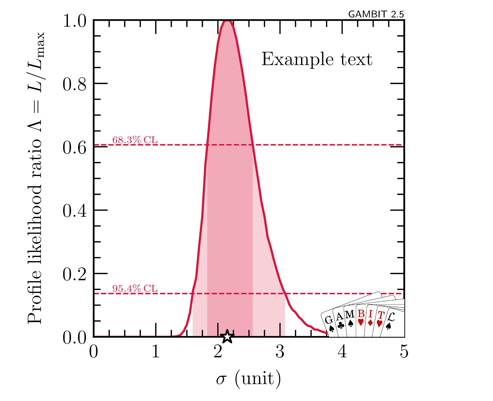
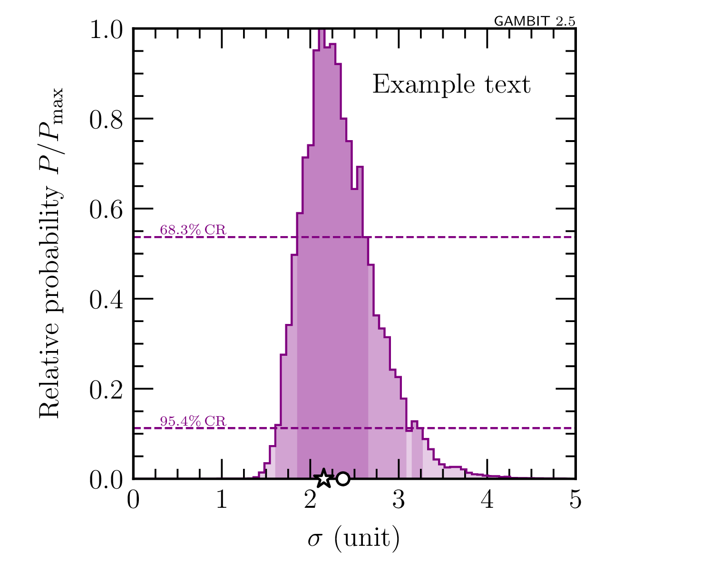
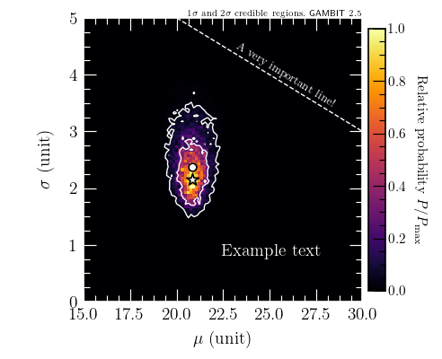

# GAMBIT plotting tools

A collection of plotting tools developed for use with **GAMBIT** and **GAMBIT-light** (see [gambitbsm.org](https://gambitbsm.org)).


## Installation

Simply clone this repo and install using `pip`:

```terminal
git clone https://github.com/GambitBSM/gambit_plotting_tools.git
pip install ./gambit_plotting_tools
```


## Current working examples

### 1D profile likelihood plots

- Make a single 1D profile likelihood plot from the data in the hdf5 file `example_data/results_run1.hdf5`
  ```terminal
  python example_1D_profile_like_hdf5.py
  ```
  This should give a plot looking like this:
  
  


### 2D profile likelihood plots

- Make a single 2D profile likelihood plot from the data in the hdf5 file `example_data/results_run1.hdf5`
  ```terminal
  python example_2D_profile_like_hdf5.py
  ```
  This should give a plot looking like this:
  
  
  
- Make multiple 2D profile likelihood plots in one go, combining the data from the hdf5 files `example_data/results_run1.hdf5` and `example_data/results_run2.hdf5`
  ```terminal
  python example_2D_profile_like_hdf5_multiple.py
  ```

- Make a single 2D profile likelihood plot from the data in the ascii file `example_data/samples.dat`
  ```terminal
  python example_2D_profile_like_ascii.py
  ```

### 1D posterior plots

- Make a single 1D posterior plot from the data in the hdf5 file `example_data/results_multinest.hdf5`
  ```terminal
  python example_1D_posterior_hdf5.py
  ```
  This should give a plot looking like this:
  
  


### 2D posterior plots

- Make a single 2D posterior plot from the data in the hdf5 file `example_data/results_multinest.hdf5`
  ```terminal
  python example_2D_posterior_hdf5.py
  ```
  This should give a plot looking like this:
  
  


## Utility scripts

There are also some scripts for other common tasks besides plotting.

### Print dataset names
  - Read the hdf5 file `example_data/results_run1.hdf5` and print all the dataset names, ignoring datasets whose name begins with `"metadata"` or ends with `"_isvalid"`
  ```terminal
  ./print_dataset_names.py example_data/results_run1.hdf5 --ignore-startswith "metadata" --ignore-endswith "_isvalid"
  ```
  This should give an output looking like this:
  ```terminal
  data/#NormalDist_parameters @NormalDist::primary_parameters::mu
  data/#NormalDist_parameters @NormalDist::primary_parameters::sigma
  data/#normaldist_loglike @ExampleBit_A::lnL_gaussian
  data/LogLike
  data/MPIrank
  data/ModifiedLogLike
  data/Runtime(ms) interloop
  data/Runtime(ms) intraloop
  data/Runtime(ms) totalloop
  data/Runtime(ns) for #NormalDist_parameters @NormalDist::primary_parameters
  data/Runtime(ns) for #normaldist_loglike @ExampleBit_A::lnL_gaussian
  data/Suspicious Point Code
  data/pointID
  data/scanID
  data/unitCubeParameters[0]
  data/unitCubeParameters[1]
  ```

### Get parameters of the highest-likelihood points
  - Read the `data` group in the hdf5 file `example_data/results_run1.hdf5` and print the input parameters for the 3 highest-likelihood points
  ```terminal
  ./print_high_loglike_points.py example_data/results_run1.hdf5 data 3
  ```
  This should give the following output:
  ```terminal
  File:  example_data/results_run1.hdf5
  Group: data
  
  The 3 highest log-likelihood point(s):
  
  LogLike: -2.53130026064170e+01
  Parameters:
    NormalDist:
      mu: 2.08331783688065e+01
      sigma: 2.15049587260387e+00
  
  
  LogLike: -2.53130028409013e+01
  Parameters:
    NormalDist:
      mu: 2.08336541456091e+01
      sigma: 2.15096678343953e+00
  
  
  LogLike: -2.53130031660756e+01
  Parameters:
    NormalDist:
      mu: 2.08344819535121e+01
      sigma: 2.14981940988637e+00

  ```


