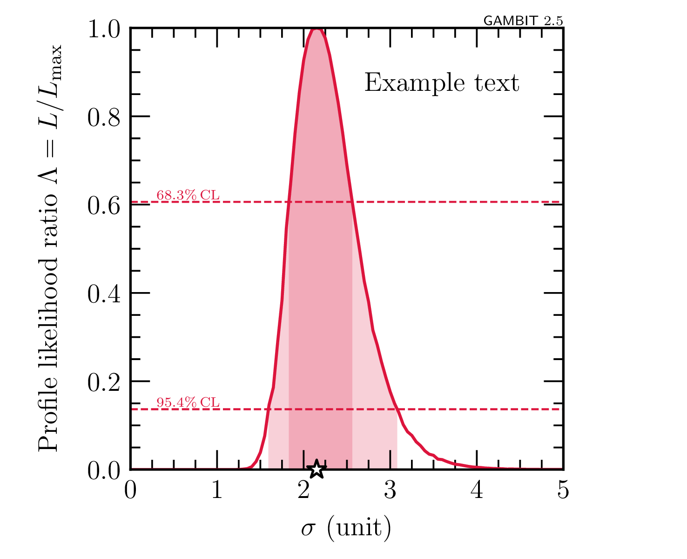

# GAMBIT plotting tools

A repo for developing a collection of Python plotting tools for GAMBIT work. 


## Current working examples

### 1D profile likelihood plots

- Make a single 1D profile likelihood plot from the data in the hdf5 file `example_data/samples_run1.hdf5`
  ```terminal
  python example_1D_profile_like_hdf5.py
  ```
  This should give a plot looking like this:
  
  


### 2D profile likelihood plots

- Make a single 2D profile likelihood plot from the data in the hdf5 file `example_data/samples_run1.hdf5`
  ```terminal
  python example_2D_profile_like_hdf5.py
  ```
  This should give a plot looking like this:
  
  
  
- Make multiple 2D profile likelihood plots in one go, combining the data from the hdf5 files `example_data/samples_run1.hdf5` and `example_data/samples_run2.hdf5`
  ```terminal
  python example_2D_profile_like_hdf5_multiple.py
  ```

- Make a single 2D profile likelihood plot from the data in the ascii file `example_data/samples.dat`
  ```terminal
  python example_2D_profile_like_ascii.py
  ```

### 1D posterior plots

- Make a single 1D posterior plot from the data in the hdf5 file `example_data/samples_multinest.hdf5`
  ```terminal
  python example_1D_posterior_hdf5.py
  ```
  This should give a plot looking like this:
  
  


### 2D posterior plots

- Make a single 2D posterior plot from the data in the hdf5 file `example_data/samples_multinest.hdf5`
  ```terminal
  python example_2D_posterior_hdf5.py
  ```
  This should give a plot looking like this:
  
  


## Utility scripts

There are also some scripts for other common tasks besides plotting.

### Print dataset names
  - Read the hdf5 file `example_data/samples_run1.hdf5` and print all the dataset names, ignoring datasets whose name begins with `"metadata"` or ends with `"_isvalid"`
  ```terminal
  python print_all_dataset_names.py example_data/samples_run1.hdf5 --ignore-startswith "metadata" --ignore-endswith "_isvalid"
  ```

### Get parameters of the highest-likelihood points
  - Read the `data` group in the hdf5 file `example_data/samples_run1.hdf5` and print the input parameters for the 3 highest-likelihood points
  ```terminal
  python print_high_loglike_points.py example_data/samples_run1.hdf5 data 3
  ```


