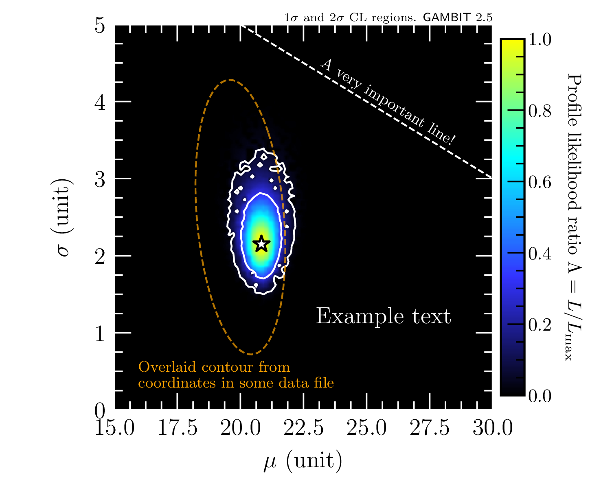
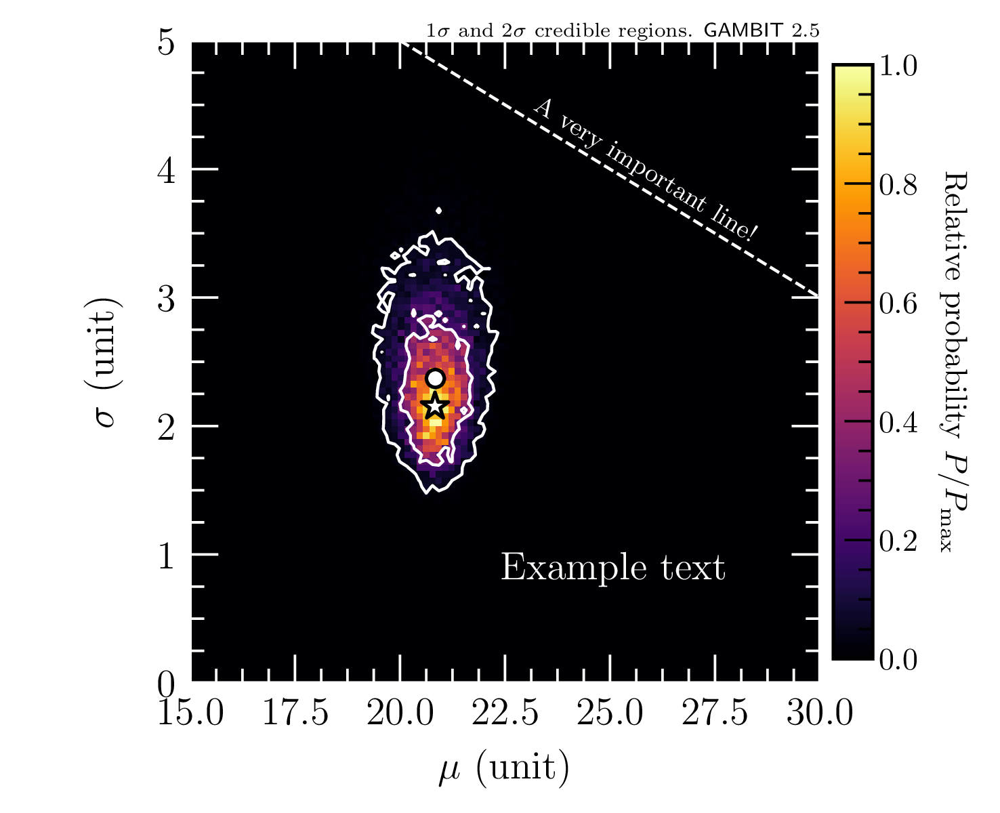

# GAMBIT plotting tools

A collection of Python tools for making publication-quality profile likelihood and posterior plots. The tools are developed in the context of **GAMBIT** and **GAMBIT-light** (see [gambitbsm.org](https://gambitbsm.org)), but can be used as standalone tools. 

## Installation

Simply install using `pip`:

```terminal
pip install git+https://github.com/GambitBSM/gambit_plotting_tools.git
```

## LaTeX text rendering

By default this package will attempt to use Matplotlib's functionality for [rendering text using LaTeX](https://matplotlib.org/stable/users/explain/text/usetex.html). A warning will be printed if the libraries required for LaTeX rendering are not found. In that case it will fall back to using Matplotlib's own [mathtext](https://matplotlib.org/stable/gallery/text_labels_and_annotations/mathtext_demo.html) functionality, and to get some decent-looking plots you probably should tweak font sizes, etc.


## Examples

### 1D profile likelihood plots

- Make a single 1D profile likelihood plot from the data in the hdf5 file `example_data/results_run1.hdf5`
  ```terminal
  python example_1D_profile_like_hdf5.py
  ```
  This should give a plot looking like this:
  
  

  This example also illustrates how to add the small GAMBIT logo to the bottom-right corner of a plot. 


### 2D profile likelihood plots

- Make a single 2D profile likelihood plot from the data in the hdf5 file `example_data/results_run1.hdf5`
  ```terminal
  python example_2D_profile_like_hdf5.py
  ```
  This should give a plot looking like this:
  
  
  
  This example also illustrates how to add a contour drawn from a set of stored coordinates, e.g. from some digitised plot.

- Make multiple 2D profile likelihood plots in one go, combining the data from the hdf5 files `example_data/results_run1.hdf5` and `example_data/results_run2.hdf5`
  ```terminal
  python example_2D_profile_like_hdf5_multiple.py
  ```

- Make a single 2D profile likelihood plot from the data in the ascii file `example_data/samples.dat`
  ```terminal
  python example_2D_profile_like_ascii.py
  ```

- Make a 2D profile likelihood plot where the profile likelihood surface is coloured according to some other dataset
  ```terminal
  python example_2D_profile_like_color_data_hdf5.py
  ```
  This example should produce a plot like this:
  
  
  

### Conditional confidence intervals

- Make a series of confidence intervals for the y variable, conditioned on the x variable being within a given range
  ```terminal
  python example_conditional_profile_intervals_shaded_hdf5.py
  python example_conditional_profile_intervals_colored_hdf5.py
  ```
  These examples give plots looking like this:

  
  

  By setting the argument `x_condition` to `x_condition="upperbound"` or `x_condition="lowerbound"` the confidence intervals for the y variable are conditioned on the x variable being below or above the given threshold:

  
  


### 1D posterior plots

- Make a single 1D posterior plot from the data in the hdf5 file `example_data/results_multinest.hdf5`
  ```terminal
  python example_1D_posterior_hdf5.py
  ```
  This should give a plot looking like this:
  
  


### 2D posterior plots

- Make a single 2D posterior plot from the data in the hdf5 file `example_data/results_multinest.hdf5`
  ```terminal
  python example_2D_posterior_hdf5.py
  ```
  This should give a plot looking like this:
  
  


- Make 2D posterior credible regions colored according to the posterior max or mean of a third dataset
  ```terminal
  python example_2D_posterior_color_data_hdf5.py
  ```
  The example should produce a plot like this:
  
  


## Utility scripts

There are also some commands for other common tasks besides plotting

### Print confidence level table
  ```terminal
  print_confidence_level_table
  ```

### Print dataset names
  - Read the hdf5 file `example_data/results_run1.hdf5` and print all the dataset names, ignoring datasets whose name begins with `"metadata"` or ends with `"_isvalid"`
  ```terminal
  print_dataset_names example_data/results_run1.hdf5 --ignore-startswith "metadata" --ignore-endswith "_isvalid"
  ```
  This should give an output looking like this:
  ```terminal
  data/#NormalDist_parameters @NormalDist::primary_parameters::mu
  data/#NormalDist_parameters @NormalDist::primary_parameters::sigma
  data/#normaldist_loglike @ExampleBit_A::lnL_gaussian
  data/LogLike
  data/MPIrank
  data/ModifiedLogLike
  data/Runtime(ms) interloop
  data/Runtime(ms) intraloop
  data/Runtime(ms) totalloop
  data/Runtime(ns) for #NormalDist_parameters @NormalDist::primary_parameters
  data/Runtime(ns) for #normaldist_loglike @ExampleBit_A::lnL_gaussian
  data/Suspicious Point Code
  data/pointID
  data/scanID
  data/unitCubeParameters[0]
  data/unitCubeParameters[1]
  ```

### Get parameters of the highest-likelihood points
  - Read the `data` group in the hdf5 file `example_data/results_run1.hdf5` and print the input parameters for the 3 highest-likelihood points
  ```terminal
  print_high_loglike_points example_data/results_run1.hdf5 data 3
  ```
  This should give the following output:
  ```terminal
  File:  example_data/results_run1.hdf5
  Group: data
  
  The 3 highest log-likelihood point(s):
  
  LogLike: -2.53130026064170e+01
  Parameters:
    NormalDist:
      mu: 2.08331783688065e+01
      sigma: 2.15049587260387e+00
  
  
  LogLike: -2.53130028409013e+01
  Parameters:
    NormalDist:
      mu: 2.08336541456091e+01
      sigma: 2.15096678343953e+00
  
  
  LogLike: -2.53130031660756e+01
  Parameters:
    NormalDist:
      mu: 2.08344819535121e+01
      sigma: 2.14981940988637e+00

  ```


